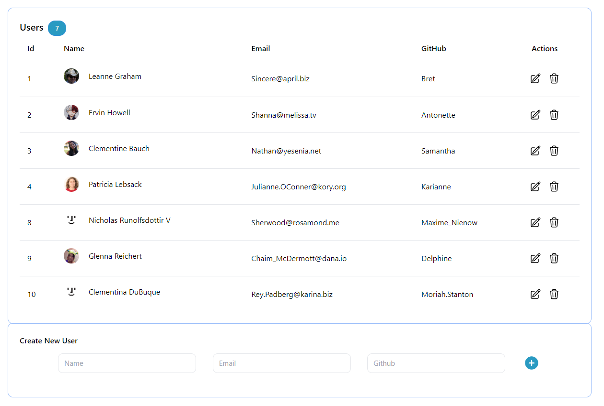
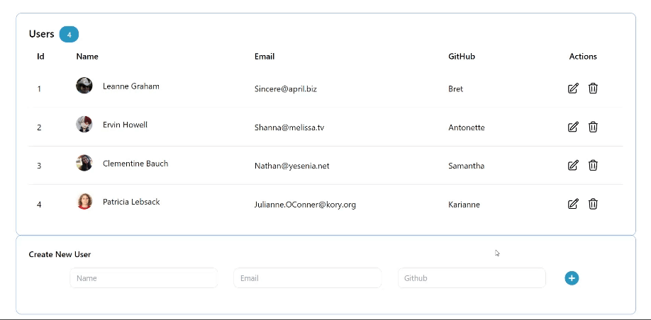
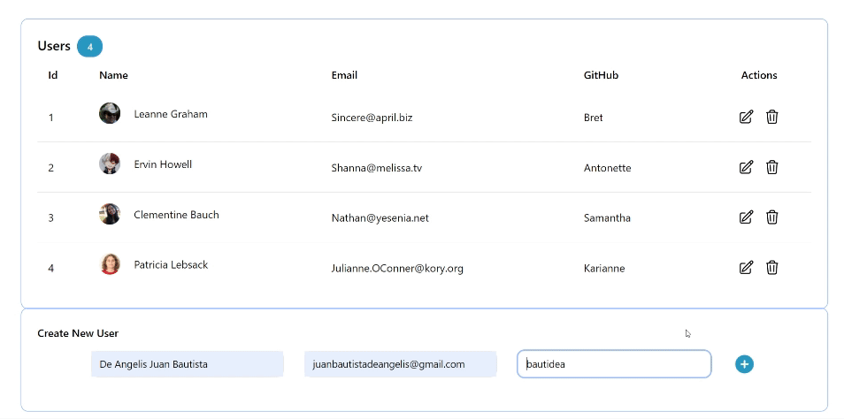
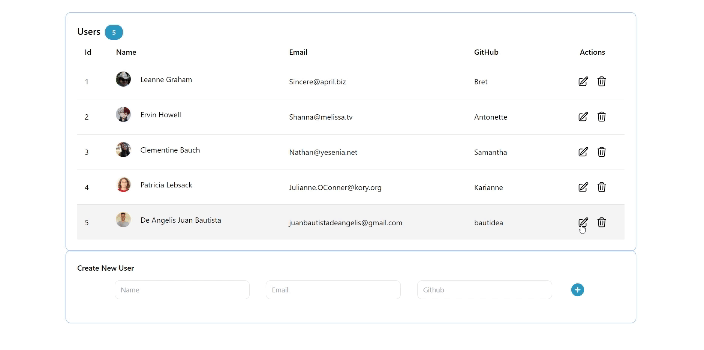

# CRUD w/ React + Redux Toolkit + Biome toolchain & Tremor.

In this project i developed a CRUD (Create Read Update Delete) to operate over a toy API, which state, will be managed by <a href='https://redux-toolkit.js.org/'>Redux Toolkit</a>.

Developed project using:

<ul>
<li><a href='https://biomejs.dev/'>Biome toolchain</a> linter.</li>
<li><a href='https://www.tremor.so/'>Tremor</a> components to build charts.</li>
<li><a href='https://redux-toolkit.js.org/'>Redux Toolkit</a> for state managing due to its simple installation </li>
<li>Used a REDUX Middleware for:
  <ul>
    <li>
      Data persistency, the state is saved locally after every update.
    </li>
    <li>
      Optimistic UI, by utilizing <a href='https://sonner.emilkowal.ski/'>Sonner</a> component, to eliminate loading UI while performing actions with the DB.
    </li>
  </ul>
</li>
<li>Used API = <a href='https://jsonplaceholder.typicode.com'>{JSON} Placeholder</a>.</li>
</ul>

